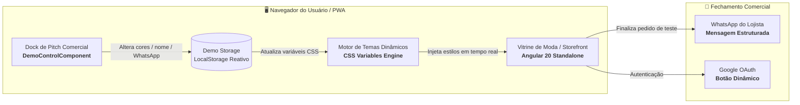

<div align="center">

  

  # ⚡ LUME SHOWCASE
  ### *Plataforma Comercial de Demonstração de Alta Conversão para E-Commerce de Moda*

  [](https://angular.dev/)
  [](https://www.typescriptlang.org/)
  [](https://sass-lang.com/)
  [](https://pages.cloudflare.com/)
  [](#)
  [](https://lume-showcase.pages.dev)

  <br />

  > ### 🌐 **[👉 ACESSAR DEMONSTRAÇÃO AO VIVO: lume-showcase.pages.dev 👈](https://lume-showcase.pages.dev)**
  > *Aplicação SPA 100% client-side hospedada na CDN global da Cloudflare. Sem servidor, sem banco de dados, sem risco de lentidão.*

  <br />

  <p align="center">
    <strong>Aplicação SPA autônoma desenvolvida para equipes comerciais e executivos de vendas apresentarem a tecnologia Lume a donos de marcas de moda com personalização visual ao vivo, estabilidade de 100% e fechamento de alto impacto.</strong>
  </p>

  <p align="center">
    <a href="#-visão-geral">Visão Geral</a> •
    <a href="#-arquitetura-zero-backend">Arquitetura</a> •
    <a href="#-principais-recursos">Recursos</a> •
    <a href="#-os-6-nichos-nativos-de-moda">Nichos de Moda</a> •
    <a href="#-pitch-mode-personalização-ao-vivo">Pitch Mode</a> •
    <a href="#-reset-em-1-toque">Reset Rápido</a> •
    <a href="#-estrutura-de-pastas">Pastas</a> •
    <a href="#-execução-e-deploy">Execução</a> •
    <a href="#-desenvolvedor--contato-comercial">Contato</a>
  </p>

  <br />

</div>

---

## 📌 Visão Geral

O **Lume Showcase** é a versão de demonstração comercial interativa da plataforma Lume. Criado especialmente para resolver os maiores gargalos de vendas de software para o varejo de moda:

- ❌ **Sem quedas de servidor:** Funciona 100% no navegador do cliente ou do vendedor.
- ❌ **Sem lentidão por conexão móvel:** Catálogos e fotos otimizadas carregadas localmente na memória do browser.
- ❌ **Sem complexidade de infraestrutura:** Não requer Docker, PostgreSQL/MySQL ou servidor Node.js ativo para rodar.
- ✅ **Personalização em Tempo Real:** Mude o nome da marca, cores e logo durante a própria reunião presencial ou call online com o prospect.

---

## 📐 Arquitetura Zero-Backend

Toda a persistência e inteligência da aplicação rodam no navegador com reatividade via **Angular Signals** e **LocalStorage**:



---

## ✨ Principais Recursos

### 🛍️ Vitrine Pública de Alta Conversão
- **Design System Dark Luxury & High-End:** Interface imersiva com paleta dark obsidian, contrastes refinados e tipografia editorial de alta legibilidade.
- **Navegação Mobile-First & Desktop:** Header com drawer lateral intuitivo para celular, busca instantânea e categorias dinâmicas.
- **Página de Produto (PDP) Detalhada:** Seletor de variações de cor e tamanho, acordeões de composição e caimento, e botão de compra rápida.
- **Sacola & Checkout Otimizado:**
  - Layout responsivo no celular com botão único de pagamento para evitar poluição visual.
  - Simulador de frete integrado (cálculo instantâneo PAC e SEDEX).
  - Fechamento flexível com envio estruturado de pedidos para o WhatsApp do prospect.
- **Área do Cliente com Login Dinâmico:**
  - Login tradicional e autenticação com Google.
  - **Botão e ícone oficial do Google com estilização dinâmica**, sincronizados instantaneamente à paleta de cores da marca ativa.
  - Central de pedidos com consulta detalhada e acompanhamento de status em tempo real.

### ⚙️ Painel de Controle Administrativo (ERP Demonstrativo)
- **Gestão de Produtos:** Cadastro, edição, precificação, inativação e fotos com compressão no cliente.
- **📸 Captura com Câmera do Dispositivo:** Tire uma foto na hora durante a reunião presencial para cadastrar uma peça de roupa do próprio prospect e vê-la imediatamente na vitrine pública.
- **Gestão de Categorias:** Organização flexível com reflexo imediato nos menus de navegação.
- **Gestão de Pedidos:** Acompanhamento de pedidos de teste com alteração de status (*Pendente*, *Pago*, *Em Separação*, *Enviado*, *Entregue*).
- **Base de Clientes:** Listagem de clientes demonstrativos com histórico de compras.

---

## 🎨 Os 6 Nichos Nativos de Moda

O vendedor pode alternar instantaneamente entre nichos de mercado com **1 clique**, carregando identidades visuais e catálogos completos:

| Nicho | Estilo & Segmento | Identidade Visual | Destaque |
| :--- | :--- | :--- | :--- |
| **⚡ Lume** *(Oficial)* | Futurewear & Tech Apparel | `Preto Cyber #080809` & `Verde Neon #0DF5A4` | Look futurista com tecidos tecnológicos |
| **🏃 Oliveira** | Moda Esportiva, Performance & Casual | `Azul Marinho #0A152E` & `Dourado Nobre #CCA45E` | Atletas, academia e lifestyle esportivo |
| **🛹 Vortex** | Streetwear Heavyweight & Cultura Urbana | `All-Black #080809` & `Vermelho Vibrante #E63946` | Oversized, capuz pesado e estética underground |
| **🌊 Maré** | Resort, Linho Puro & Beachwear | `Terracota Solar #C15C3D` & `Areia Natural #E8DFD8` | Elegância praiana, linho orgânico e tons quentes |
| **🤠 Terra Forte** | Moda Country, Western & Vaquejada | `Couro Rústico #140E0A` & `Âmbar Dourado #D97706` | Tradição sertaneja, fivelas e rusticidade nobre |
| **🪡 Atelier Aura** | Alfaiataria Feminina & Luxo Minimalista | `Grafite #0E0E10` & `Pérola Nobre #F5F5F7` | Cortes precisos, alfaiataria fina e alta-costura |

---

## ⚡ Pitch Mode: Personalização ao Vivo

Durante reuniões comerciais, o vendedor clica no ícone da varinha mágica flutuante e abre o dock de personalização (`DemoControlComponent`):

1. **Nome da Marca:** Digite o nome da marca do cliente (ex.: *"Camila Modas"*, *"Black Skull"*). A loja inteira, cabeçalho, rodapé e títulos atualizam no milissegundo seguinte.
2. **Color Pickers em Tempo Real:** Modifique a cor primária, secundária e fundos — todos os botões, banners, tags e ícones (inclusive o botão do Google) atualizam instantaneamente via variáveis CSS (`--primary`, `--surface`, `--header-bg`, etc.).
3. **WhatsApp do Cliente:** Insira o WhatsApp do próprio prospect. Ao finalizar um pedido de teste na sacola, o cliente recebe o pedido estruturado direto no celular dele, vivenciando a experiência de compra do seu futuro e-commerce!

---

## 🔄 Reset em 1 Toque

Pensado para representantes comerciais que realizam múltiplas reuniões por dia:

- **1-Tap Wipe:** Limpa o carrinho de teste, descarta personalizações provisórias, zera dados de demonstração e restaura o catálogo oficial Lume.
- **5 Pontos de Acesso Estratégicos:**
  1. *Botão Flutuante Rápido:* Posicionado acima da varinha mágica de demonstração em qualquer tela.
  2. *Menu Lateral Mobile (Drawer):* Botão destacado no rodapé da navegação no celular.
  3. *Cabeçalho do Painel Demo:* Botão rápido no topo do painel flutuante.
  4. *Rodapé do Painel Demo:* Botão expandido de restauração completa.
  5. *Rodapé da Loja:* Botão no rodapé da página.

---

## 📁 Estrutura de Pastas

```text
lume-showcase/
├── public/
│   ├── images/
│   │   ├── lume-logo.png              # Logo oficial Lume
│   │   ├── hero-lume.jpg              # Banner principal da vitrine
│   │   └── products/                  # Imagens por nicho de demonstração
│   └── favicon.ico
├── src/
│   ├── app/
│   │   ├── core/                      # Camada central da aplicação
│   │   │   ├── config/
│   │   │   │   ├── demo-themes.ts     # Configuração dos 6 nichos e catálogos padrão
│   │   │   │   └── store.config.ts    # Configurações globais da vitrine
│   │   │   ├── models/                # Interfaces TypeScript (Produto, Categoria, Pedido, Cliente)
│   │   │   └── services/
│   │   │       ├── demo-storage.service.ts  # Gerenciador reativo de estado e LocalStorage
│   │   │       ├── cart.service.ts          # Gerenciamento da sacola
│   │   │       └── whatsapp.service.ts      # Montagem de mensagens para WhatsApp
│   │   ├── features/                  # Módulos funcionais
│   │   │   ├── store/                 # Vitrine (Home, Catálogo, PDP, Carrinho, Checkout)
│   │   │   ├── customer-area/         # Central do Cliente e Rastreamento
│   │   │   ├── auth/                  # Telas de Login/Registro e Google OAuth
│   │   │   ├── products/              # Painel Admin: Produtos & Câmera
│   │   │   ├── categories/            # Painel Admin: Categorias
│   │   │   ├── orders/                # Painel Admin: Pedidos
│   │   │   ├── customers/             # Painel Admin: Clientes
│   │   │   └── settings/              # Painel Admin: Ajustes da Loja
│   │   ├── layouts/                   # Layouts (StoreLayout, MainLayout, AuthLayout)
│   │   └── shared/                    # Componentes compartilhados
│   │       └── components/demo-control/  # Dock flutuante do vendedor
│   └── styles.scss                    # Variáveis CSS nativas e design tokens
└── angular.json
```

---

## 💻 Execução e Deploy

### Pré-requisitos
- **Node.js**: v18+ ou v20+
- **NPM**

### 1. Rodar Localmente
```bash
# Instalar dependências
npm install

# Iniciar servidor local
npm start
# ou
ng serve --port 4300
```
Acesse no navegador: `http://localhost:4300`

### 2. Gerar Build de Produção
```bash
npm run build
```
O build estático ultra-otimizado será gerado no diretório `dist/lume-showcase/browser`.

### 3. Hospedagem & CDN
Como o projeto é 100% estático e não requer servidor backend, pode ser hospedado com custo zero em qualquer serviço de Edge CDN:
- **Cloudflare Pages** *(Configuração ativa em [lume-showcase.pages.dev](https://lume-showcase.pages.dev))*
- **Vercel**
- **Netlify**
- **GitHub Pages**

---

## 👨‍💻 Desenvolvedor & Contato Comercial

Plataforma idealizada e desenvolvida por **Eduardo Theodoro**.

<div align="center">

  [](https://www.linkedin.com/in/eduardot97)
  [](https://wa.me/5511961742713?text=Ol%C3%A1%20Eduardo,%20vim%20pelo%20Lume%20Showcase!)
  [](mailto:entwicklermavericks@gmail.com)
  [](mailto:eduardotheodorofegit@gmail.com)

</div>

<br />

| Canal | Informação / Link Direto |
| :--- | :--- |
| 👤 **Nome** | **Eduardo Theodoro** |
| 💼 **LinkedIn** | [linkedin.com/in/eduardot97](https://www.linkedin.com/in/eduardot97) |
| 📱 **WhatsApp** | [**+55 (11) 96174-2713**](https://wa.me/5511961742713?text=Ol%C3%A1%20Eduardo,%20vim%20pelo%20Lume%20Showcase!) |
| 📧 **E-mail Principal** | [entwicklermavericks@gmail.com](mailto:entwicklermavericks@gmail.com) |
| 📧 **E-mail Dev / Git** | [eduardotheodorofegit@gmail.com](mailto:eduardotheodorofegit@gmail.com) |
| 🎯 **Foco de Atuação** | *Desenvolvimento Fullstack, Arquitetura SPA/Edge, Customizações White-Label & E-Commerce de Alta Performance* |

---

<div align="center">
  <sub>© 2026 Lume Commerce — Tecnologia White-Label de Alta Conversão para o Varejo de Moda.</sub>
</div>
